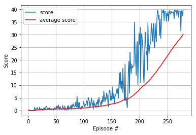

# Report

In this project we train a double-jointed arm to move to target locations. 
The goal of your agent is to maintain its position at the target location for as many time steps as possible.

The observation space consists of 33 variables corresponding to position, rotation, velocity, and angular velocities of the arm. 
Each action is a vector with four numbers, corresponding to torque applicable to two joints.

### The algorithm

The learning algorithm used in the project is the deep deterministic policy gradient (DDPG) algorithm ([Lillicrap et al. 2016](https://arxiv.org/pdf/1509.02971.pdf)).

The algorithm combines the actor-critic approach with insights from the success of Deep Q Network (DQN) ([Mnih et al. 2015](https://storage.googleapis.com/deepmind-media/dqn/DQNNaturePaper.pdf)). 
DQN cannot be straightforwardly applied to continuous domains since it relies on a finding the action that maximizes the
action-value function, which in the continuous valued case requires an iterative optimization process at every step.
The application of DQN by simply discretizing the action space has many limitations.
The DDPG algorithm is based on the deterministic policy gradient (DPG) algorithm ([Silver et al. 2014](http://proceedings.mlr.press/v32/silver14.pdf)).
The DPG algorithm maintains a parameterized actor function which specifies the current policy by deterministically mapping states to a specific action. 
The critic is learned using the Bellman equation as in Q-learning.

### Implementation

In our implementation the neural network of the actor has 4 fully connected layers respectively with input/output dimensions of 33/800, 800/400, 400/300, 300/4.
The neural network of the critic has 3 fully connected layers respectively with input/output dimensions of 33/400, 400/300, 300/1.
The networks use ReLUs as activation functions.

The final hyperparameter choice is the following:   

BUFFER_SIZE = int(1e5)  # replay buffer size.  
BATCH_SIZE = 128        # minibatch size.  
GAMMA = 0.99            # discount factor.  
TAU = 1e-3              # for soft update of target parameters.  
LR_ACTOR = 2e-4         # learning rate of the actor.      
LR_CRITIC = 2e-4        # learning rate of the critic.  
WEIGHT_DECAY = 1e-4     # L2 weight decay.  

### Result

   
The plot of the scores shows the learning of the algorithm.  

The agent solved the environment in 278	episodes, with an average score over the last 100 episodes of 30.21. The training took about 50minutes using a GPU.

## Future work
We tested a few combinations of hyperparameters, but to improve the score and decrease the number of episodes to solve the environment
we could perform an exhaustive hyperparameters search and optimization.
Other work could include solving the environment with 20 agents, and test different algorithms like proximal policy optimization (PPO),
the advantage actor-critic (A2C or A3C) or the distributed distributional deep deterministic policy gradient (D4PG).
